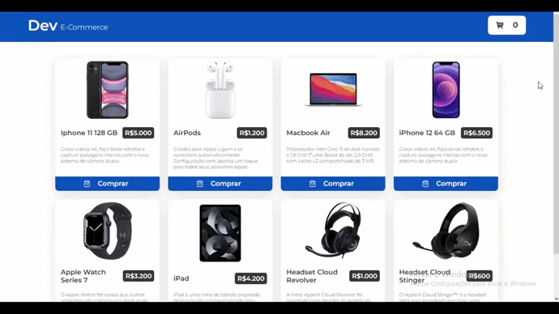
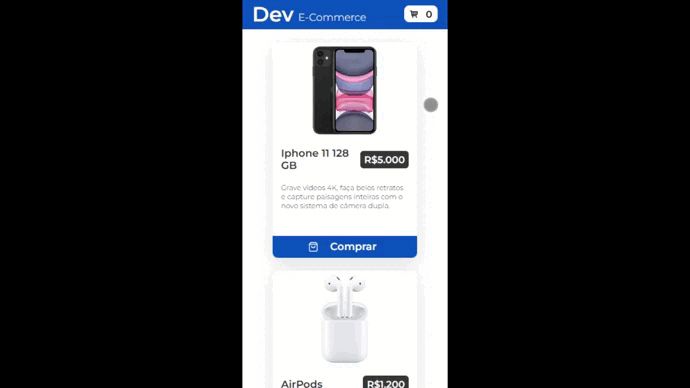

# Dev E-Commerce

## | About

This is a project where I learned a lot with. All the challenges I've faced doing it, all the time, all the experiences make this project very special.

## | Overview

## | Mobile Version

## | Made Using
<ul>
    <li>ReactJS</li>
    <li>Typescript</li>
    <li>Styled-Components</li>
    <li>Axios</li>
    <li>React-Icons</li>
    <li>Redux Toolkit</li>
    <li>Jest</li>
</ul>

## | How to Run

Make sure "Git" is installed in your PC!

    git clone https://github.com/Bruno-Messias-B-S/Dev-Ecommerce.git
    
### To Install
    npm install

### To Run
    npm run dev

## | Made By
[Bruno Messias](https://www.linkedin.com/in/bruno-messias-bs/)
